# EMR Database Table Diagram
## Comprehensive Entity Relationship Diagram

*Visual representation of all database tables and their relationships*

---

## 🗄️ **Database Schema Overview**

```mermaid
erDiagram
    %% Core System Tables
    TENANT {
        string id PK
        string name
        string domain UK
        string subdomain UK
        json settings
        enum status
        datetime createdAt
        datetime updatedAt
    }

    USER {
        string id PK
        string tenantId FK
        string email
        string password
        string firstName
        string lastName
        enum role
        json permissions
        boolean isActive
        datetime lastLoginAt
        datetime createdAt
        datetime updatedAt
    }

    USER_PROFILE {
        string id PK
        string userId FK
        string phone
        json address
        string[] specialties
        string licenseNumber
        string npiNumber
        string signature
        datetime createdAt
        datetime updatedAt
    }

    %% Patient Management
    PATIENT {
        string id PK
        string tenantId FK
        string mrn UK
        string firstName
        string lastName
        string middleName
        datetime dateOfBirth
        enum gender
        string phone
        string email
        json address
        json medicalHistory
        json familyHistory
        json socialHistory
        json emergencyContacts
        string language
        json communicationPrefs
        json privacySettings
        enum status
        datetime registrationDate
        datetime lastVisitDate
        datetime createdAt
        datetime updatedAt
    }

    PATIENT_INSURANCE {
        string id PK
        string patientId FK
        enum insuranceType
        string policyNumber
        string groupNumber
        string subscriberId
        string subscriberName
        string relationship
        datetime effectiveDate
        datetime expirationDate
        decimal copay
        decimal deductible
        datetime createdAt
        datetime updatedAt
    }

    IDENTITY_DOCUMENT {
        string id PK
        string patientId FK
        enum docType
        string docNumber
        string issuingState
        datetime expirationDate
        string fileUrl
        boolean verified
        datetime verifiedAt
        datetime createdAt
        datetime updatedAt
    }

    ALLERGY {
        string id PK
        string patientId FK
        string allergen
        enum allergyType
        enum severity
        string reaction
        string notes
        datetime onsetDate
        datetime createdAt
        datetime updatedAt
    }

    %% Appointments & Visits
    DEPARTMENT {
        string id PK
        string tenantId FK
        string name
        string code
        string description
        boolean isActive
        datetime createdAt
        datetime updatedAt
    }

    FACILITY {
        string id PK
        string tenantId FK
        string name
        json address
        string phone
        string email
        boolean isActive
        datetime createdAt
        datetime updatedAt
    }

    APPOINTMENT {
        string id PK
        string tenantId FK
        string patientId FK
        string doctorId FK
        string facilityId FK
        string departmentId FK
        datetime startTime
        datetime endTime
        int duration
        enum appointmentType
        enum status
        enum priority
        string reasonForVisit
        string notes
        string location
        string roomNumber
        boolean isRecurring
        json recurringPattern
        string parentAppointmentId
        json remindersSent
        enum confirmationStatus
        datetime createdAt
        datetime updatedAt
    }

    VISIT {
        string id PK
        string appointmentId FK
        string patientId FK
        datetime checkInTime
        datetime checkOutTime
        enum visitType
        string chiefComplaint
        enum status
        string currentLocation
        int waitTime
        datetime createdAt
        datetime updatedAt
    }

    %% Clinical Documentation
    MEDICAL_RECORD {
        string id PK
        string patientId FK
        string doctorId FK
        string visitId FK
        string subjective
        string objective
        string assessment
        string plan
        string chiefComplaint
        string historyOfPresentIllness
        string reviewOfSystems
        string physicalExam
        string[] icdCodes
        string[] cptCodes
        boolean aiGenerated
        string templateUsed
        float confidence
        int version
        enum status
        datetime signedAt
        string signedBy
        datetime createdAt
        datetime updatedAt
    }

    DIAGNOSIS {
        string id PK
        string medicalRecordId FK
        string code
        string description
        enum diagnosisType
        enum severity
        enum status
        datetime onsetDate
        datetime resolvedDate
        datetime createdAt
        datetime updatedAt
    }

    VITAL_SIGNS {
        string id PK
        string patientId FK
        string visitId FK
        string recordedBy
        float temperature
        int bloodPressureSystolic
        int bloodPressureDiastolic
        int heartRate
        int respiratoryRate
        float oxygenSaturation
        float weight
        float height
        float bmi
        int painScale
        float glucoseLevel
        float cholesterol
        datetime recordedAt
        string deviceUsed
        string notes
        datetime createdAt
        datetime updatedAt
    }

    %% Prescriptions
    PRESCRIPTION {
        string id PK
        string patientId FK
        string doctorId FK
        string medication
        string genericName
        string strength
        string dosageForm
        string dosage
        string frequency
        string duration
        int quantity
        int refills
        string instructions
        string indications
        string warnings
        enum status
        datetime prescribedAt
        datetime filledAt
        string pharmacyId
        string digitalSignature
        string dea
        boolean isControlled
        enum formularyStatus
        boolean priorAuthRequired
        string priorAuthNumber
        decimal copay
        json interactions
        json allergyAlerts
        datetime createdAt
        datetime updatedAt
    }

    %% Laboratory
    LAB_ORDER {
        string id PK
        string patientId FK
        string orderingPhysicianId FK
        string orderNumber UK
        datetime orderDate
        enum priority
        enum status
        string clinicalInfo
        string diagnosis
        string[] icdCodes
        string specimenType
        datetime collectionDate
        string collectedBy
        string[] aiRecommendedTests
        datetime createdAt
        datetime updatedAt
    }

    LAB_TEST {
        string id PK
        string labOrderId FK
        string testCode
        string testName
        string category
        enum urgency
        datetime createdAt
        datetime updatedAt
    }

    LAB_RESULT {
        string id PK
        string labOrderId FK
        string patientId FK
        string testCode
        string testName
        string value
        float numericValue
        string unit
        string referenceRange
        enum status
        enum abnormalFlag
        boolean isCritical
        datetime criticalNotifiedAt
        json aiAnalysis
        string aiInterpretation
        datetime collectedAt
        datetime resultedAt
        datetime verifiedAt
        string verifiedBy
        datetime createdAt
        datetime updatedAt
    }

    %% Medical Imaging
    MEDICAL_IMAGE {
        string id PK
        string patientId FK
        string orderId
        string studyInstanceUID UK
        string seriesInstanceUID
        string sopInstanceUID UK
        string dicomFile
        string studyType
        string bodyPart
        datetime studyDate
        string modality
        json aiFindings
        float aiConfidence
        boolean abnormalitiesDetected
        string pacsId
        enum pacsStatus
        enum status
        datetime createdAt
        datetime updatedAt
    }

    RADIOLOGY_REPORT {
        string id PK
        string imageId FK
        string radiologistId FK
        string findings
        string impression
        string recommendations
        string aiDraftContent
        boolean aiAssisted
        enum status
        datetime dictatedAt
        datetime transcribedAt
        datetime signedAt
        datetime createdAt
        datetime updatedAt
    }

    %% Telehealth
    TELEHEALTH_SESSION {
        string id PK
        string patientId FK
        string providerId
        string appointmentId FK
        enum sessionType
        datetime startTime
        datetime endTime
        int duration
        string sessionUrl
        string recordingUrl
        boolean isRecorded
        enum status
        string connectionQuality
        string sessionNotes
        string technicalIssues
        datetime createdAt
        datetime updatedAt
    }

    %% Billing
    BILLING_RECORD {
        string id PK
        string patientId FK
        string appointmentId FK
        string invoiceNumber UK
        datetime billDate
        datetime dueDate
        decimal totalAmount
        decimal paidAmount
        decimal balanceAmount
        enum status
        datetime createdAt
        datetime updatedAt
    }

    BILLING_LINE_ITEM {
        string id PK
        string billingRecordId FK
        string serviceCode
        string description
        int quantity
        decimal unitPrice
        decimal totalPrice
        string[] icdCodes
        string[] modifiers
        datetime createdAt
        datetime updatedAt
    }

    INSURANCE_CLAIM {
        string id PK
        string billingRecordId FK
        string claimNumber UK
        datetime submissionDate
        enum claimType
        decimal claimedAmount
        decimal approvedAmount
        decimal paidAmount
        enum status
        string denialReason
        datetime processedDate
        datetime paymentDate
        datetime createdAt
        datetime updatedAt
    }

    %% Audit
    AUDIT_LOG {
        string id PK
        string userId FK
        string tenantId
        string action
        string resource
        string resourceId
        json details
        string ipAddress
        string userAgent
        string sessionId
        boolean success
        string error
        datetime timestamp
        int duration
    }

    %% Relationships
    TENANT ||--o{ USER : "has"
    TENANT ||--o{ PATIENT : "manages"
    TENANT ||--o{ APPOINTMENT : "schedules"
    TENANT ||--o{ DEPARTMENT : "contains"
    TENANT ||--o{ FACILITY : "operates"

    USER ||--o| USER_PROFILE : "has"
    USER ||--o{ APPOINTMENT : "attends"
    USER ||--o{ PRESCRIPTION : "prescribes"
    USER ||--o{ LAB_ORDER : "orders"
    USER ||--o{ MEDICAL_RECORD : "creates"
    USER ||--o{ RADIOLOGY_REPORT : "writes"
    USER ||--o{ AUDIT_LOG : "generates"

    PATIENT ||--o{ PATIENT_INSURANCE : "has"
    PATIENT ||--o{ IDENTITY_DOCUMENT : "provides"
    PATIENT ||--o{ ALLERGY : "has"
    PATIENT ||--o{ APPOINTMENT : "books"
    PATIENT ||--o{ VISIT : "makes"
    PATIENT ||--o{ MEDICAL_RECORD : "owns"
    PATIENT ||--o{ VITAL_SIGNS : "has"
    PATIENT ||--o{ PRESCRIPTION : "receives"
    PATIENT ||--o{ LAB_ORDER : "gets"
    PATIENT ||--o{ LAB_RESULT : "has"
    PATIENT ||--o{ MEDICAL_IMAGE : "has"
    PATIENT ||--o{ TELEHEALTH_SESSION : "participates"
    PATIENT ||--o{ BILLING_RECORD : "owes"

    APPOINTMENT ||--o| VISIT : "becomes"
    APPOINTMENT }o--|| DEPARTMENT : "scheduled_in"
    APPOINTMENT }o--|| FACILITY : "located_at"
    APPOINTMENT ||--o| TELEHEALTH_SESSION : "enables"

    VISIT ||--o{ VITAL_SIGNS : "records"
    VISIT ||--o{ MEDICAL_RECORD : "documents"

    MEDICAL_RECORD ||--o{ DIAGNOSIS : "contains"

    LAB_ORDER ||--o{ LAB_TEST : "includes"
    LAB_ORDER ||--o{ LAB_RESULT : "produces"

    MEDICAL_IMAGE ||--o{ RADIOLOGY_REPORT : "generates"

    BILLING_RECORD ||--o{ BILLING_LINE_ITEM : "contains"
    BILLING_RECORD ||--o| INSURANCE_CLAIM : "creates"
```

---

## 📊 **Table Categories & Relationships**

### 🏢 **Core System (4 tables)**
- **Tenant** → Multi-organization support
- **User** → System users with roles
- **UserProfile** → Extended user information
- **AuditLog** → Activity tracking

### 👥 **Patient Management (4 tables)**
- **Patient** → Core patient information
- **PatientInsurance** → Insurance details
- **IdentityDocument** → Document verification
- **Allergy** → Allergy tracking

### 📅 **Scheduling & Visits (5 tables)**
- **Department** → Organizational units
- **Facility** → Physical locations
- **Appointment** → Appointment scheduling
- **Visit** → Visit tracking
- **VitalSigns** → Clinical measurements

### 📝 **Clinical Documentation (3 tables)**
- **MedicalRecord** → SOAP notes and clinical data
- **Diagnosis** → ICD-10 coded diagnoses
- **Prescription** → E-prescribing system

### 🔬 **Laboratory (3 tables)**
- **LabOrder** → Test ordering
- **LabTest** → Individual tests
- **LabResult** → Test results

### 🖼️ **Medical Imaging (2 tables)**
- **MedicalImage** → DICOM images
- **RadiologyReport** → Radiology reports

### 💻 **Telehealth (1 table)**
- **TelehealthSession** → Video consultations

### 💰 **Billing & Financial (3 tables)**
- **BillingRecord** → Patient billing
- **BillingLineItem** → Itemized charges
- **InsuranceClaim** → Insurance processing

---

## 🔗 **Key Relationships**

### **One-to-Many Relationships**
- `Tenant` → `User`, `Patient`, `Appointment`
- `Patient` → `Appointment`, `MedicalRecord`, `Prescription`
- `User` → `Appointment`, `Prescription`, `LabOrder`
- `Appointment` → `Visit`
- `MedicalRecord` → `Diagnosis`
- `LabOrder` → `LabTest`, `LabResult`

### **One-to-One Relationships**
- `User` ↔ `UserProfile`
- `Appointment` ↔ `Visit`
- `BillingRecord` ↔ `InsuranceClaim`

### **Many-to-Many Relationships**
- `Patient` ↔ `User` (through appointments)
- `Patient` ↔ `Department` (through appointments)

---

## 📈 **Database Statistics**

| Category | Tables | Key Features |
|----------|--------|--------------|
| **Core System** | 4 | Multi-tenant, RBAC, Audit |
| **Patient Mgmt** | 4 | Demographics, Insurance, Documents |
| **Clinical** | 6 | Appointments, Visits, Records, Vitals |
| **Prescriptions** | 1 | E-prescribing, Drug interactions |
| **Laboratory** | 3 | Orders, Tests, Results, AI analysis |
| **Imaging** | 2 | DICOM, PACS, AI analysis |
| **Telehealth** | 1 | Video sessions, Remote care |
| **Billing** | 3 | Claims, Payments, Insurance |
| **Total** | **24** | **Full EMR Coverage** |

---

## 🎯 **Performance Optimizations**

### **Strategic Indexes**
- **Patient Search**: `firstName`, `lastName`, `phone`, `email`
- **Appointment Queries**: `tenantId + startTime`, `patientId + startTime`
- **Clinical Records**: `patientId + createdAt`, full-text search
- **Billing**: `patientId`, `status`, `invoiceNumber`
- **Audit**: `userId + timestamp`, `action`, `resource`

### **Full-Text Search**
- Patient names: `@@fulltext([firstName, lastName])`
- Medical records: `@@fulltext([subjective, objective, assessment, plan])`

---

*This diagram represents a production-ready EMR database schema with proper relationships, indexing, and HIPAA compliance features.*
