# EMR System Architecture
## Comprehensive Technical Architecture Design

*Complete system architecture for enterprise-grade EMR with all 33 modules*

---

## 🏗️ **Complete System Architecture**

```mermaid
graph TB
    %% Client Layer
    subgraph "Client Layer"
        WEB[Web Browser]
        MOBILE[Mobile App]
        TABLET[Tablet App]
    end

    %% Load Balancer & CDN
    subgraph "Edge Layer"
        CDN[CloudFlare CDN]
        LB[Load Balancer<br/>NGINX/AWS ALB]
    end

    %% Frontend Layer
    subgraph "Frontend Layer"
        NEXTJS[Next.js 14+<br/>React Frontend]
        PWA[Progressive Web App]
        ADMIN[Admin Dashboard]
    end

    %% API Gateway
    subgraph "API Gateway Layer"
        GATEWAY[API Gateway<br/>Kong/AWS API Gateway]
        AUTH[Authentication Service<br/>JWT + OAuth2]
        RATE[Rate Limiting]
    end

    %% Backend Services (Microservices)
    subgraph "Backend Services"
        %% Core Services
        CORE[Core API<br/>NestJS]
        USER[User Management<br/>Service]
        TENANT[Tenant Management<br/>Service]
        
        %% Clinical Services
        PATIENT[Patient Management<br/>Service]
        APPT[Appointment<br/>Service]
        CLINICAL[Clinical Documentation<br/>Service]
        PRESCRIPTION[E-Prescribing<br/>Service]
        
        %% Laboratory & Imaging
        LAB[Laboratory<br/>Service]
        PACS[PACS Integration<br/>Service]
        IMAGING[Medical Imaging<br/>Service]
        
        %% AI Services
        AI_CORE[AI Core Service<br/>OpenAI Integration]
        AI_CLINICAL[Clinical AI<br/>Service]
        AI_IMAGING[AI Imaging<br/>Analysis]
        
        %% Communication Services
        NOTIFICATION[Notification<br/>Service]
        TELEHEALTH[Telehealth<br/>Service]
        SMS[SMS Service<br/>Twilio]
        EMAIL[Email Service<br/>SendGrid]
        
        %% Financial Services
        BILLING[Billing<br/>Service]
        PAYMENT[Payment<br/>Service]
        INSURANCE[Insurance<br/>Service]
        
        %% Integration Services
        HL7[HL7/FHIR<br/>Integration]
        EXTERNAL[External API<br/>Integration]
        WEBHOOK[Webhook<br/>Service]
    end

    %% Data Layer
    subgraph "Data Layer"
        %% Primary Database
        POSTGRES[(PostgreSQL<br/>Multi-tenant)]
        
        %% Cache & Queue
        REDIS[(Redis<br/>Cache + Sessions)]
        BULL[Bull Queue<br/>Background Jobs]
        
        %% Search & Analytics
        ELASTIC[(Elasticsearch<br/>Medical Records Search)]
        ANALYTICS[(Analytics DB<br/>ClickHouse)]
        
        %% File Storage
        S3[(AWS S3<br/>Medical Files)]
        DICOM[(DICOM Storage<br/>Medical Images)]
    end

    %% External Services
    subgraph "External Services"
        %% AI Services
        OPENAI[OpenAI API<br/>GPT-4 + Whisper]
        AZURE_AI[Azure Cognitive<br/>Services]
        
        %% Healthcare APIs
        DRUG_DB[Drug Database<br/>API]
        LAB_API[Laboratory<br/>APIs]
        PHARMACY[Pharmacy<br/>Networks]
        
        %% Communication
        TWILIO[Twilio<br/>SMS/Voice]
        SENDGRID[SendGrid<br/>Email]
        
        %% Payment & Insurance
        STRIPE[Stripe<br/>Payments]
        INSURANCE_API[Insurance<br/>APIs]
        
        %% Healthcare Standards
        FHIR_SERVER[FHIR Server<br/>Interoperability]
        EHR_SYSTEMS[External EHR<br/>Systems]
    end

    %% Monitoring & Security
    subgraph "Monitoring & Security"
        PROMETHEUS[Prometheus<br/>Metrics]
        GRAFANA[Grafana<br/>Dashboards]
        SENTRY[Sentry<br/>Error Tracking]
        AUDIT[Audit Service<br/>HIPAA Compliance]
        SECURITY[Security Scanner<br/>Vulnerability Mgmt]
    end

    %% Infrastructure
    subgraph "Infrastructure"
        DOCKER[Docker<br/>Containers]
        K8S[Kubernetes<br/>Orchestration]
        AWS[AWS Cloud<br/>Infrastructure]
        BACKUP[Backup Service<br/>Automated]
    end

    %% Connections
    WEB --> CDN
    MOBILE --> CDN
    TABLET --> CDN
    
    CDN --> LB
    LB --> NEXTJS
    LB --> PWA
    LB --> ADMIN
    
    NEXTJS --> GATEWAY
    PWA --> GATEWAY
    ADMIN --> GATEWAY
    
    GATEWAY --> AUTH
    GATEWAY --> RATE
    GATEWAY --> CORE
    
    %% Core Service Connections
    CORE --> USER
    CORE --> TENANT
    CORE --> PATIENT
    CORE --> APPT
    CORE --> CLINICAL
    CORE --> PRESCRIPTION
    CORE --> LAB
    CORE --> PACS
    CORE --> IMAGING
    CORE --> BILLING
    
    %% AI Service Connections
    CLINICAL --> AI_CLINICAL
    IMAGING --> AI_IMAGING
    AI_CORE --> AI_CLINICAL
    AI_CORE --> AI_IMAGING
    
    %% Communication Connections
    APPT --> NOTIFICATION
    PRESCRIPTION --> NOTIFICATION
    LAB --> NOTIFICATION
    NOTIFICATION --> SMS
    NOTIFICATION --> EMAIL
    
    %% Data Connections
    USER --> POSTGRES
    TENANT --> POSTGRES
    PATIENT --> POSTGRES
    APPT --> POSTGRES
    CLINICAL --> POSTGRES
    PRESCRIPTION --> POSTGRES
    LAB --> POSTGRES
    BILLING --> POSTGRES
    
    %% Cache Connections
    CORE --> REDIS
    USER --> REDIS
    PATIENT --> REDIS
    
    %% Queue Connections
    NOTIFICATION --> BULL
    AI_CORE --> BULL
    BILLING --> BULL
    
    %% Search Connections
    CLINICAL --> ELASTIC
    PATIENT --> ELASTIC
    
    %% File Storage Connections
    IMAGING --> S3
    PACS --> DICOM
    CLINICAL --> S3
    
    %% External API Connections
    AI_CORE --> OPENAI
    AI_IMAGING --> AZURE_AI
    PRESCRIPTION --> DRUG_DB
    LAB --> LAB_API
    PRESCRIPTION --> PHARMACY
    SMS --> TWILIO
    EMAIL --> SENDGRID
    PAYMENT --> STRIPE
    INSURANCE --> INSURANCE_API
    HL7 --> FHIR_SERVER
    HL7 --> EHR_SYSTEMS
    
    %% Monitoring Connections
    CORE --> PROMETHEUS
    PROMETHEUS --> GRAFANA
    CORE --> SENTRY
    USER --> AUDIT
    
    %% Infrastructure Connections
    CORE --> DOCKER
    DOCKER --> K8S
    K8S --> AWS
    POSTGRES --> BACKUP
```

---

## 🔧 **Detailed Component Architecture**

### **Frontend Layer Architecture**

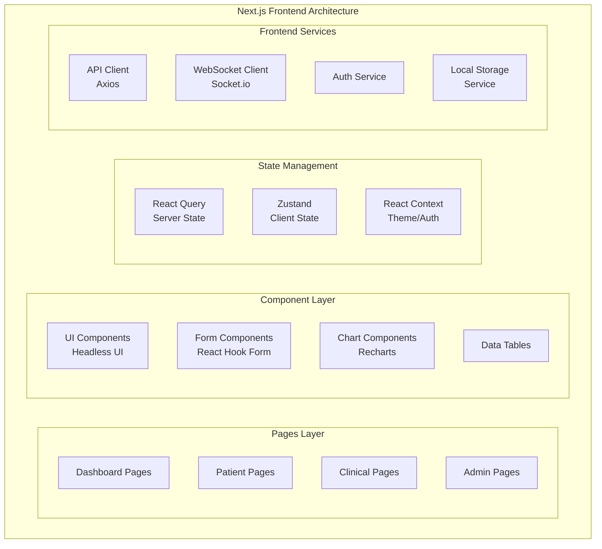

### **Backend Microservices Architecture**

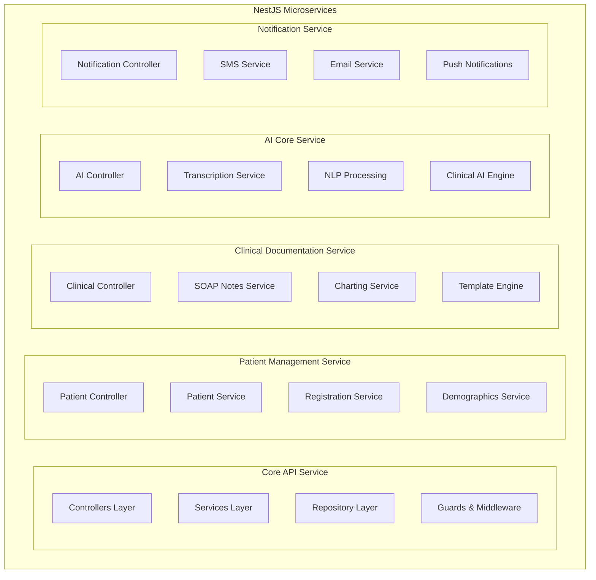

### **Database Architecture**

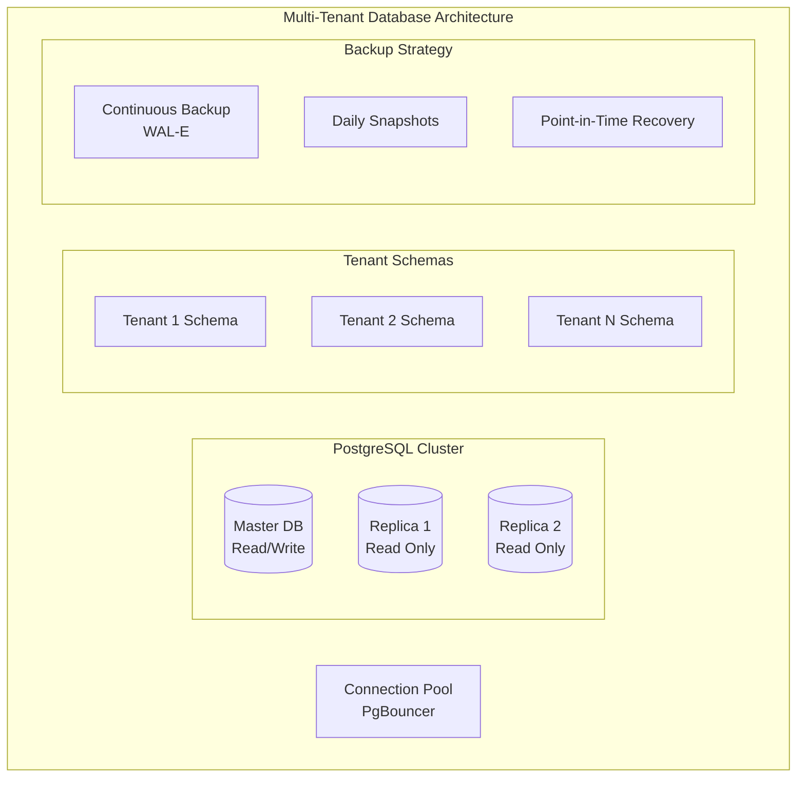

---

## 🚀 **Deployment Architecture**

### **Kubernetes Deployment**

```yaml
# Kubernetes Architecture Overview
apiVersion: v1
kind: Namespace
metadata:
  name: emr-system

---
# Core API Deployment
apiVersion: apps/v1
kind: Deployment
metadata:
  name: emr-core-api
  namespace: emr-system
spec:
  replicas: 3
  selector:
    matchLabels:
      app: emr-core-api
  template:
    metadata:
      labels:
        app: emr-core-api
    spec:
      containers:
      - name: emr-core-api
        image: emr/core-api:latest
        ports:
        - containerPort: 3000
        env:
        - name: DATABASE_URL
          valueFrom:
            secretKeyRef:
              name: db-secret
              key: url
        resources:
          requests:
            memory: "512Mi"
            cpu: "250m"
          limits:
            memory: "1Gi"
            cpu: "500m"

---
# Frontend Deployment
apiVersion: apps/v1
kind: Deployment
metadata:
  name: emr-frontend
  namespace: emr-system
spec:
  replicas: 2
  selector:
    matchLabels:
      app: emr-frontend
  template:
    metadata:
      labels:
        app: emr-frontend
    spec:
      containers:
      - name: emr-frontend
        image: emr/frontend:latest
        ports:
        - containerPort: 3000
        resources:
          requests:
            memory: "256Mi"
            cpu: "100m"
          limits:
            memory: "512Mi"
            cpu: "200m"
```

### **AWS Infrastructure**

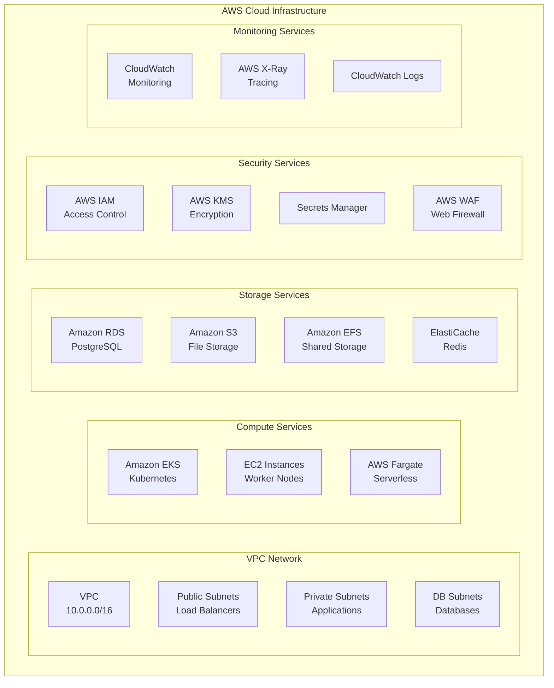

---

## 🔒 **Security Architecture**

### **Multi-Layer Security**

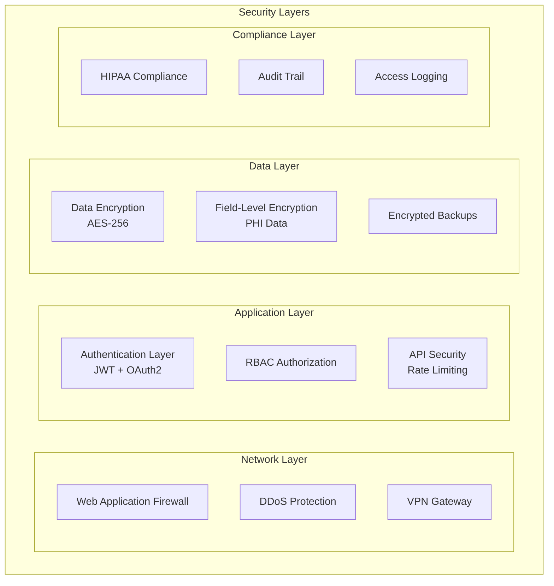

### **Authentication & Authorization Flow**

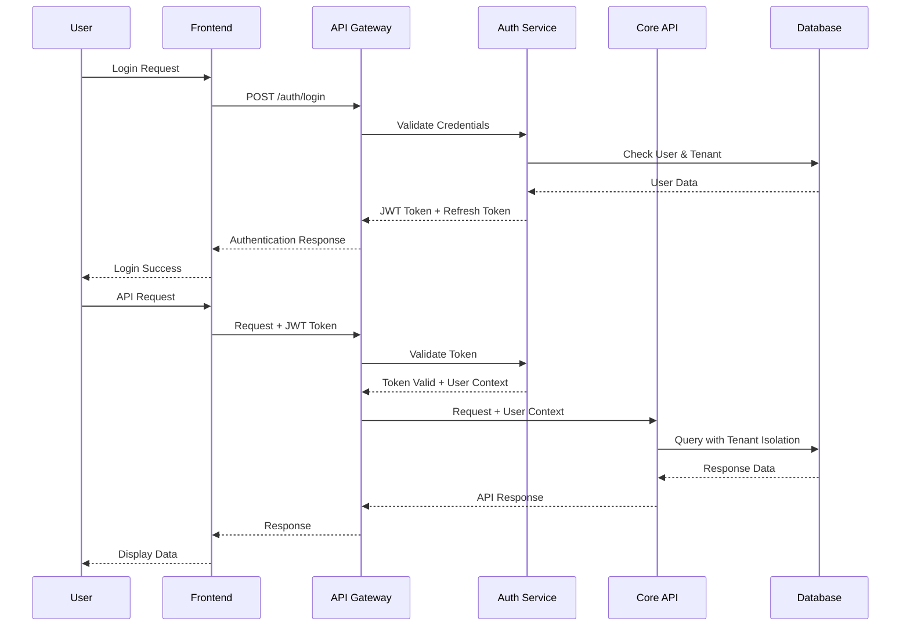

---

## 📊 **Data Flow Architecture**

### **Clinical Data Flow**

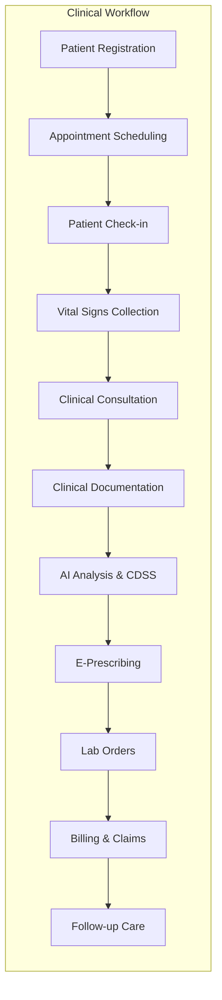

### **AI Processing Pipeline**

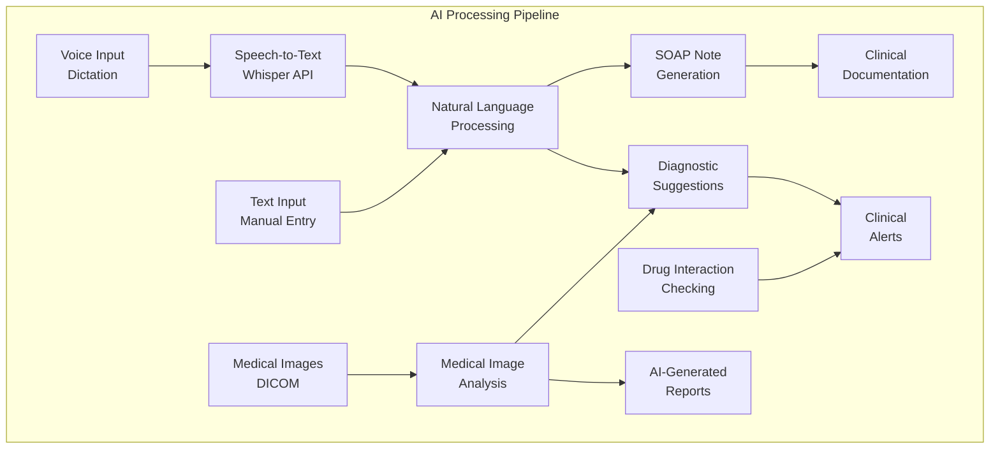

---

## 🔄 **Integration Architecture**

### **HL7/FHIR Integration**

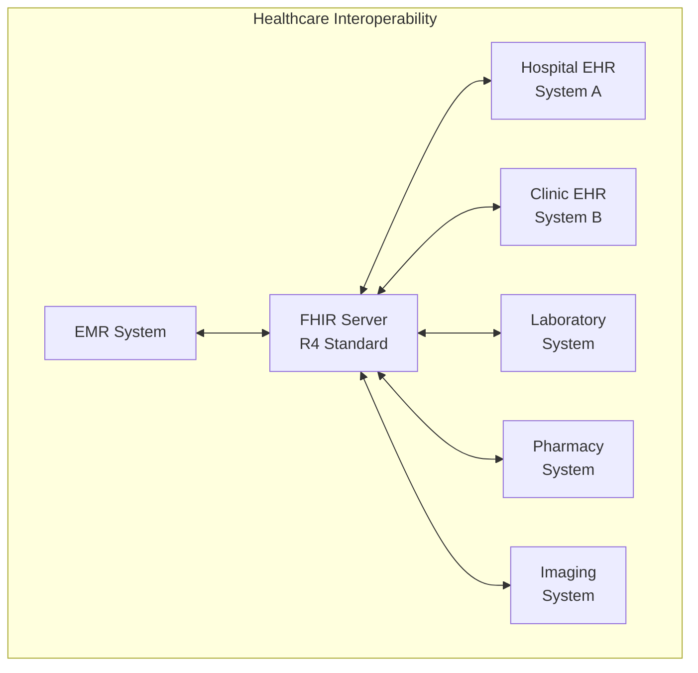

---

## 📈 **Scalability & Performance**

### **Auto-Scaling Strategy**

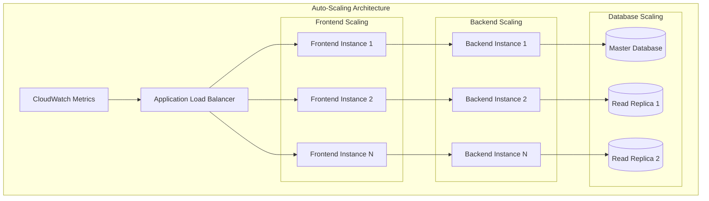

### **Performance Optimization**

| Component | Optimization Strategy | Expected Performance |
|-----------|----------------------|---------------------|
| **Frontend** | Code splitting, lazy loading, CDN | < 2s initial load |
| **API Gateway** | Rate limiting, caching, compression | < 100ms response |
| **Backend Services** | Connection pooling, query optimization | < 200ms average |
| **Database** | Indexing, read replicas, partitioning | < 50ms query time |
| **File Storage** | CDN, compression, caching | < 1s file access |
| **Search** | Elasticsearch optimization | < 100ms search |

---

## 🎯 **Architecture Benefits**

### **Scalability**
- **Horizontal scaling** with Kubernetes auto-scaling
- **Database read replicas** for improved performance
- **Microservices architecture** for independent scaling
- **CDN integration** for global content delivery

### **Reliability**
- **99.9% uptime SLA** with redundant systems
- **Automated failover** and disaster recovery
- **Health checks** and monitoring at all layers
- **Circuit breaker patterns** for fault tolerance

### **Security**
- **Multi-layer security** with defense in depth
- **HIPAA compliance** with comprehensive audit trails
- **End-to-end encryption** for data protection
- **Zero-trust architecture** with strict access controls

### **Performance**
- **Sub-2 second** page load times
- **Real-time updates** with WebSocket connections
- **Optimized database queries** with proper indexing
- **Intelligent caching** at multiple layers

---

*This comprehensive system architecture provides a production-ready foundation for building a scalable, secure, and compliant EMR system with all 33 modules.*
